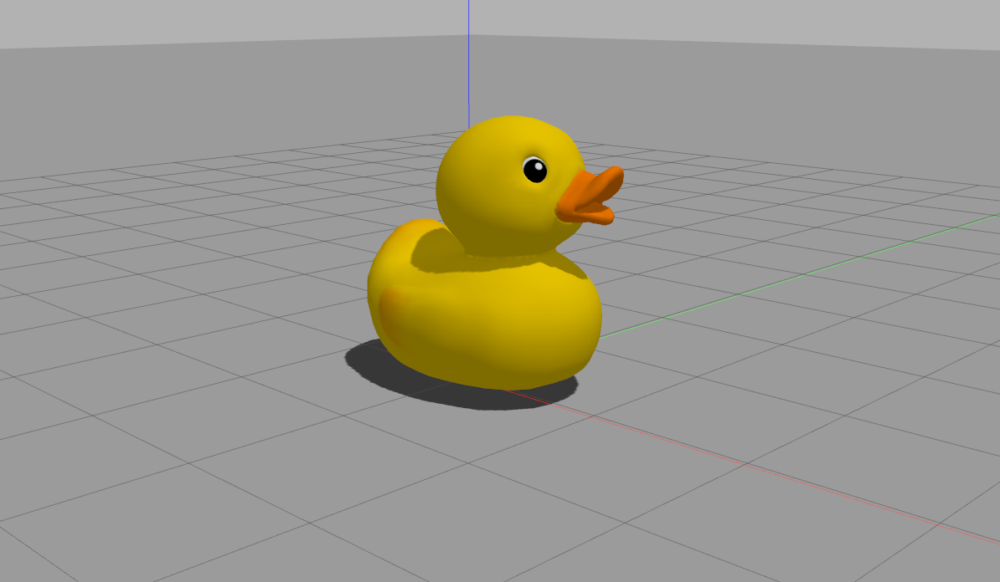

# [メッシュの挿入](http://gazebosim.org/tutorials?tut=import_mesh)

このチュートリアルではGazeboにメッシュを挿入する方法について学びます．

このチュートリアルでは，Gazeboのワールド設定ファイルとして`sdf`ファイルを，メッシュのファイルとして`dae`を利用します．

|  ファイルの規格  | 拡張子 |                     説明                     |
| :--------------: | :----: | :------------------------------------------: |
|     sdf(SDF)     | .world | Gazeboのワールドを記述するための設定ファイル |
| collada(Collada) |  .dae  |  3Dモデル（メッシュ）のファイル．色情報付き  |
|     slt(STL)     |  .stl  |  3Dモデル（メッシュ）のファイル．色情報無し  |


## メッシュの準備

Gazeboでは右手系の座標系を使用します．右手系とはｚ軸が上向き，ｘ軸が前向き（画面の方向），ｙ軸が左向きの座標系です．

### 複雑さを減らすために

多くのメッシュは過度に複雑になる可能性があります．数千の三角形からなるメッシュは，その三角形の数を減らすか分割することが効率のために望ましいです．三角形を減らしたり，複数のメッシュに分割するために，あなたが使用してる3Dメッシュ編集ソフトの説明を読んでみてください．

### メッシュの中心

最初のステップはメッシュを中心(0,0,0)に置き，（これは主観的になりますが）メッシュの正面がｘ軸に沿うようにしてください．

### メッシュのスケール

Gazeboの距離の単位はメートルです．多くの3D編集ソフトではメートルが基準単位になっていないので，３D編集ソフトの設定を変更して，基準単位をメートルにしてください．

## メッシュのエクスポート

メッシュが適切に準備できたなら，`Collada` ファイルとしてエクスポートしてください．この`Collada`ファイルは3次元情報と色情報を含みます．注意点として`Collada`ファイルの拡張子は`.dae`です．

## メッシュのテスト

エクスポートしたメッシュをテストする最も簡単な方法は，簡単なワールドファイル`my_mesh.world`をつくり，その中で，メッシュを読み込むことです．下記の`my_mesh.dae`を実際のファイル名に置き換えてください．また，注意点として`sdf`ファイルの拡張子は`.world`です．

```xml
<?xml version="1.0"?>
<sdf version="1.4">
    <world name="default">
        <include>
            <uri>model://ground_plane</uri>
        </include>
        <include>
            <uri>model://sun</uri>
        </include>
        <model name="my_mesh">
            <pose>0 0 0  0 0 0</pose>
            <static>true</static>
            <link name="body">
                <visual name="visual">
                    <geometory>
                        <mesh><uri>file://my_desh.dae</uri></mesh>
                    </geometory>
                </visual>
            </link>
        </model>
    </world>
</sdf>
```
### 実行方法

Gazeboにmy_mesh.worldファイルを[渡す方法](https://qiita.com/srs/items/9b23ad12bea9e3ec0480)はいくつかありますが，今回は最も簡単な方法を利用します．すなわち，Gazebo起動時の引数としてmy_mesh.worldファイルを渡す方法です．my_mesh.worldがおいてあるディレクトリに移動して下記のコマンドを打ってください．

```
gazebo my_mesh.world
```

### テスト用のメッシュ

テスト用のメッシュとして[dock.dae](https://web.archive.org/web/20120513213905/http://www.c3dl.org/wp-content/2.0Release/Resources/duck.dae)と[dock.png](https://web.archive.org/web/20120513204538/http://www.c3dl.org/wp-content/2.0Release/Resources/duck.png)を使ってください．これらをダウンロードしてworldファイルと同じディレクトリにおいてください．このduckメッシュはｙ軸が上を向くように設定されているので（Gazeboはｚ軸が上向き），sdfファイル(my_mesh.world)を編集してdockを回転させてください．

```xml
<visual name="visual">
    <pose>0 0 0 1.5708 0 0</pose>
    <geometory>
    <mesh><uri>file://dock.dae</uri></mesh>
    </geometory>
</visual>
```


